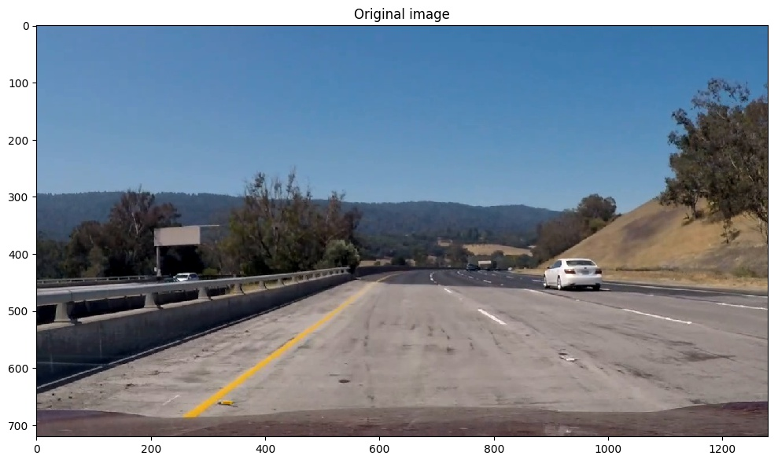
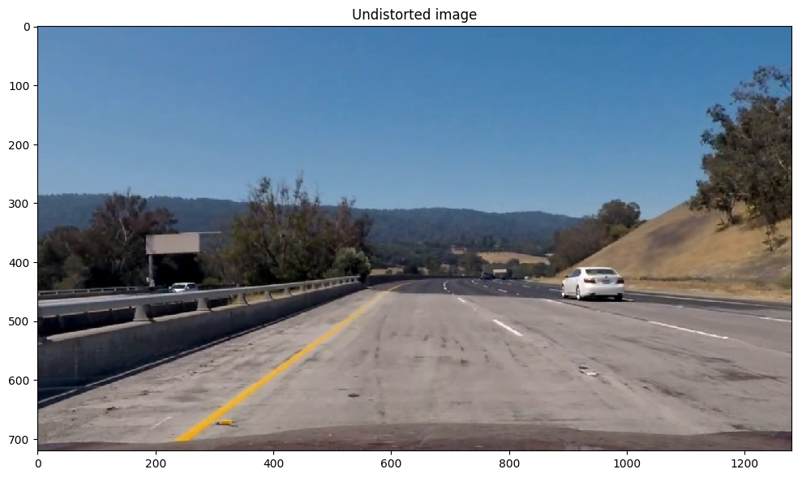
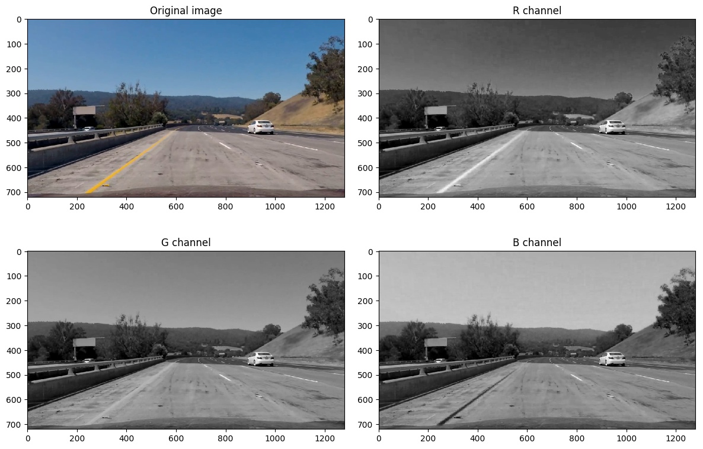
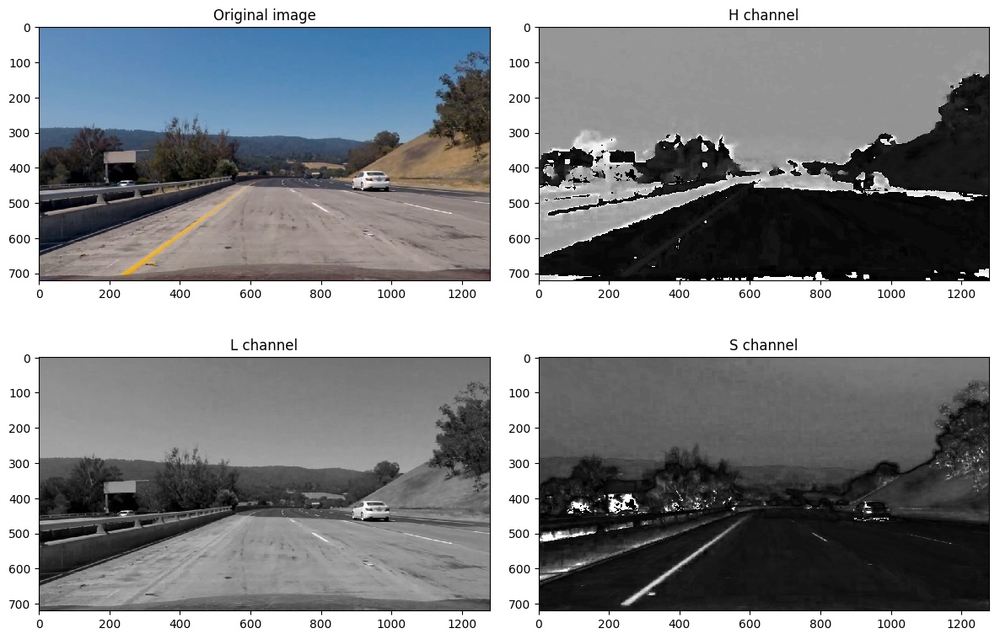
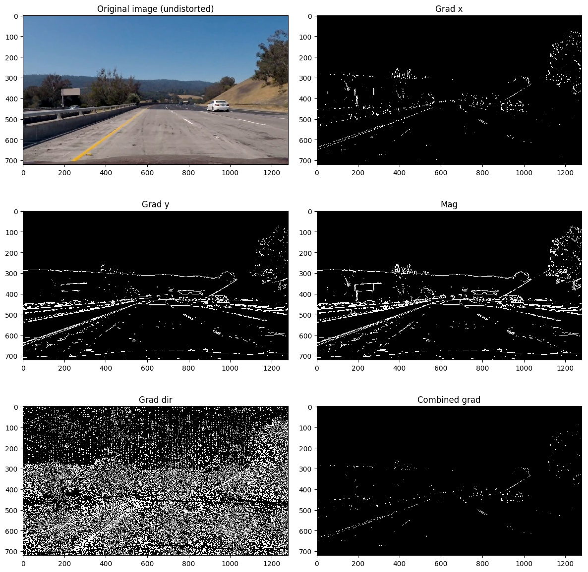
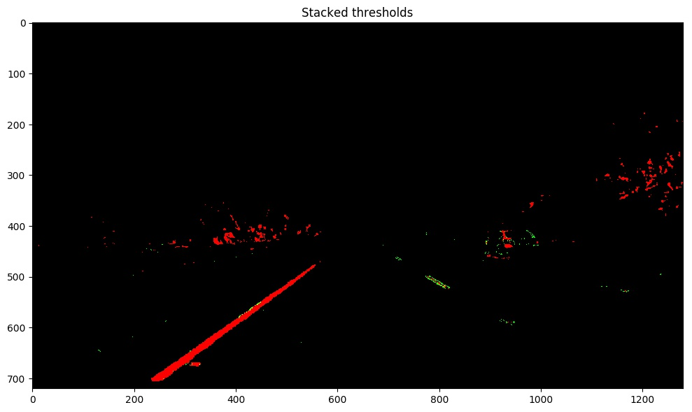
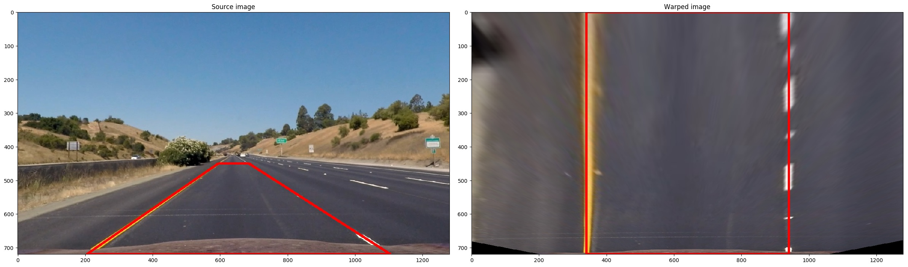
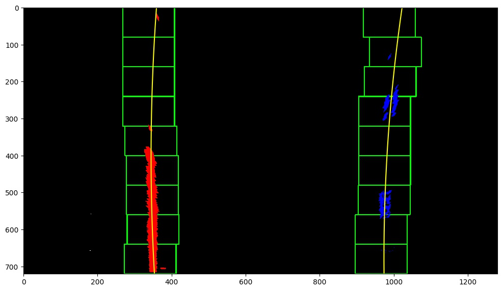
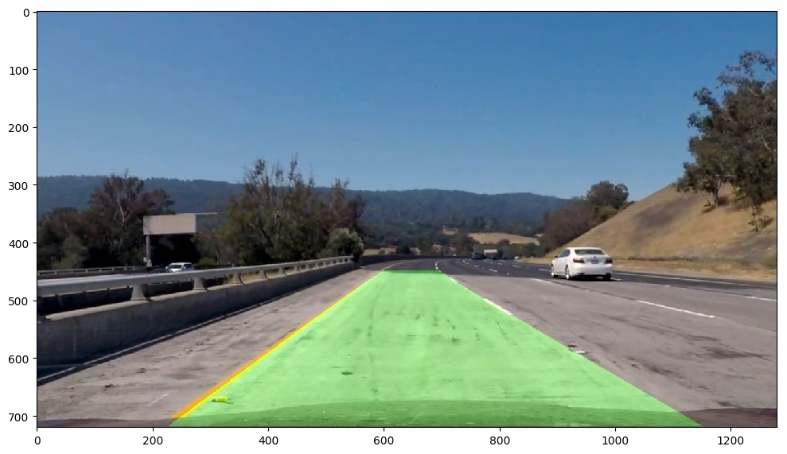

# Advanced Lane Finding Project

The goals / steps of this project are the following:

* Compute the camera calibration matrix and distortion coefficients given a set of chessboard images.
* Apply a distortion correction to raw images.
* Use color transforms, gradients, etc., to create a thresholded binary image.
* Apply a perspective transform to rectify binary image ("birds-eye view").
* Detect lane pixels and fit to find the lane boundary.
* Determine the curvature of the lane and vehicle position with respect to center.
* Warp the detected lane boundaries back onto the original image.
* Output visual display of the lane boundaries and numerical estimation of lane curvature and vehicle position.


## [Rubric](https://review.udacity.com/#!/rubrics/571/view) Points

### Here I will consider the rubric points individually and describe how I addressed each point in my implementation.  

---

### Writeup / README

#### 1. Provide a Writeup / README that includes all the rubric points and how you addressed each one.  You can submit your writeup as markdown or pdf.  [Here](https://github.com/udacity/CarND-Advanced-Lane-Lines/blob/master/writeup_template.md) is a template writeup for this project you can use as a guide and a starting point.  

You're reading it!

### Camera Calibration

#### 1. Briefly state how you computed the camera matrix and distortion coefficients. Provide an example of a distortion corrected calibration image.

The code for this step is as follows.
```python
# Find all calibration image files
image_files = glob.glob('camera_cal/calibration*.jpg')

# Arrays to store object points and image points of all calibration images
object_points = []  # 3D points to in real world space
image_points = []  # 2D points in image plane

# Prepare object points
nx = 9
ny = 6
obj_pts = np.zeros((nx * ny, 3), np.float32)
obj_pts[:, :2] = np.mgrid[0:nx, 0:ny].T.reshape(-1, 2)

# Figure to show calibration images with detected corners (if successful)
fig, axes = plt.subplots(4, 5, figsize=(12, 6))
fig.tight_layout()
# Iterate through all calibration images
for i, image_file in enumerate(image_files):
    # Read in the calibration image
    image = mpimg.imread(image_file)

    # Convert the image to gray scale
    gray = cv2.cvtColor(image, cv2.COLOR_RGB2GRAY)

    # Find the chessboard corners
    ret, corners = cv2.findChessboardCorners(gray, (nx, ny), None)

    # If corners are found, append object points and image points
    if ret:
        image_points.append(corners)
        object_points.append(obj_pts)

        # Draw the detected corners
        image = cv2.drawChessboardCorners(image, (nx, ny), corners, ret)
        axes[i // 5, i % 5].imshow(image)

    # Set the axis off
    axes[i // 5, i % 5].axis('off')

# Calibrate camera
ret, mtx, dist, rvecs, tvecs = cv2.calibrateCamera(
    object_points, image_points, gray.shape[::-1], None, None)
```

I start by preparing "object points", which will be the (x, y, z) coordinates of the chessboard corners in the world. Here I am assuming the chessboard is fixed on the (x, y) plane at z=0, such that the object points are the same for each calibration image.  Thus, `obj_pts` is just a replicated array of coordinates, and `object_points` will be appended with a copy of it every time I successfully detect all chessboard corners in a test image.  `image_points` will be appended with the (x, y) pixel position of each of the corners in the image plane with each successful chessboard detection.  

I then used the output `object_points` and `image_points` to compute the camera calibration and distortion coefficients using the `cv2.calibrateCamera()` function.  I applied this distortion correction to the test image using the `cv2.undistort()` function on a test image and obtained this result:




### Pipeline (single images)

#### 1. Provide an example of a distortion-corrected image.

To demonstrate this step, I will describe how I apply the distortion correction to one of the test images like this one shown above.

#### 2. Describe how (and identify where in your code) you used color transforms, gradients or other methods to create a thresholded binary image.  Provide an example of a binary image result.

I used a combination of color and gradient thresholds to generate a binary image.
```python
# Get R channel image
r_channel = image[:, :, 0]
r_binary = color_thresh(r_channel, thresh=(150, 255))

# Convert to HLS color space and separate the S channel
hls = cv2.cvtColor(image, cv2.COLOR_RGB2HLS)
s_channel = hls[:, :, 2]
s_binary = color_thresh(s_channel, thresh=(100, 255))

# Get the H channel image
# Shadow tend to have high S value and also H value
# By thresholding H value can avoid detect shadow as lane markers
h_channel = hls[:, :, 0]
h_binary = color_thresh(h_channel, thresh=(0, 100))

gradx_binary = abs_sobel_thresh(
    r_channel, orient='x', sobel_kernel=3, thresh=(30, 100))
grady_binary = abs_sobel_thresh(r_channel, orient='y', sobel_kernel=3, thresh=(30, 100))

mag_binary = mag_thresh(r_channel, sobel_kernel=3, thresh=(30, 100))
dir_binary = dir_thresh(r_channel, sobel_kernel=3, thresh=(0.7, 1.3))
# grad_binary = np.uint8(gradx_binary | (mag_binary & dir_binary))
grad_binary = np.uint8(gradx_binary & grady_binary)

combined_binary = (h_binary & s_binary) | (grad_binary & r_binary)
```

Here are RGB color channel images for the test image.


Here are HLS color channel images for the test image.


Here are various gradients for the test image.


Here's an example of combined binary output. In particular, the red color is the pixels obtained by `(h_binary & s_binary)` and green color is the pixels obtained by `(grad_binary & r_binary)`.


#### 3. Describe how (and identify where in your code) you performed a perspective transform and provide an example of a transformed image.

The following OpenCV function is used for perspective transform.
```python
warped = cv2.warpPerspective(image, self.M, image.shape[1::-1], flags=cv2.INTER_LINEAR)
```

I chose the hardcode the source and destination points and get the perspective matrix in the following manner:

```python
src = np.array([[205, 720], [595, 450], [685, 450], [1105, 720]])
dst = np.array([[340, 720], [340, 0], [940, 0], [940, 720]])
M = cv2.getPerspectiveTransform(src.astype(np.float32), dst.astype(np.float32))
Minv = cv2.getPerspectiveTransform(dst.astype(np.float32), src.astype(np.float32))
```

This resulted in the following source and destination points:

| Source        | Destination   |
|:-------------:|:-------------:|
| 205, 720      | 340, 720      |
| 595, 450      | 340, 0        |
| 685, 450      | 940, 0        |
| 1105, 720     | 940, 720      |

I verified that my perspective transform was working as expected by drawing the `src` and `dst` points onto a test image and its warped counterpart to verify that the lines appear parallel in the warped image.


#### 4. Describe how (and identify where in your code) you identified lane-line pixels and fit their positions with a polynomial?

Then I did some other stuff and fit my lane lines (in function `find_lines()`) with a 2nd order polynomial kinda like this:



#### 5. Describe how (and identify where in your code) you calculated the radius of curvature of the lane and the position of the vehicle with respect to center.

Here is the code for calculating the radius of curvature of the left/right lane lines.
```python
# Define y-value where we want radius of curvature
# I'll choose the maximum y-value, corresponding to the bottom of the image
y_eval = np.max(ploty)

# Define conversions in x and y from pixels space to meters
ym_per_pix = 30 / 720  # meters per pixel in y dimension
xm_per_pix = 3.7 / 700  # meters per pixel in x dimension
# Fit new polynomials to x,y in world space
fit_cr = np.polyfit(ploty * ym_per_pix, self.fitx * xm_per_pix, 2)
# Calculate the new radii of curvature
self.radius_of_curvature = ((1 + (2 * fit_cr[0] * y_eval + fit_cr[1])**2)**1.5) / np.absolute(2 * fit_cr[0])
```

And here is how I calculated the position of the vehicle with respect to the center of lane. First, for each detected line, find out the distance to the vehicle center (assumed to be the center of image).
```python
dist_in_pix = self.fitx[-1] - center
xm_per_pix = 3.7 / 700
self.line_base_pos = dist_in_pix * xm_per_pix
```
Then, the offset can be obtained by
```python
offset = (self.left.line_base_pos + self.right.line_base_pos) / 2
```

#### 6. Provide an example image of your result plotted back down onto the road such that the lane area is identified clearly.

The code for plotting the result back onto the undistorted image is in function `overlay_image()`.
```python
# Create an image to draw the lines on
warp_zero = np.zeros_like(warped).astype(np.uint8)
color_warp = np.dstack((warp_zero, warp_zero, warp_zero))

# Recast the x and y points into usable format for cv2.fillPoly()
pts_left = np.array([np.transpose(np.vstack([self.left.fitx, self.ploty]))])
pts_right = np.array([np.flipud(np.transpose(np.vstack([self.right.fitx, self.ploty])))])
pts = np.hstack((pts_left, pts_right))

# Draw the lane onto the warped blank image
cv2.fillPoly(color_warp, np.int_([pts]), (0, 255, 0))

# Warp the blank back to original image space using inverse perspective matrix (Minv)
newwarp = self.inverse_perspective_transform(color_warp)

# Combine the result with the original image
result = cv2.addWeighted(undistorted, 1, newwarp, 0.3, 0)
```
Here is the result on the running test image:


---

### Pipeline (video)

#### 1. Provide a link to your final video output.  Your pipeline should perform reasonably well on the entire project video (wobbly lines are ok but no catastrophic failures that would cause the car to drive off the road!).

Here's a [link to my video result](./result_project_video.mp4)

---

### Discussion

#### 1. Briefly discuss any problems / issues you faced in your implementation of this project. Where will your pipeline likely fail?  What could you do to make it more robust?

I faced the following issues with this project:

- The color thresholds are very hard to tune. The parameters can be tuned to perform well on a few images but do no transfer well on other images. Basically there is no perfect parameters for all images.

- Finding lines based on the fitted lines from last frame helps locate the useful pixels on the new image, but it seems not improving the computational speed that much. The main bottleneck speed wise is the color thresholding, especially multiple color channels have to be extracted and gradients need to be computed.

- Using the fixed pixel to world coordinates conversion may not be a good idea.

- The vehicle orientation is not considered. This approach can not deal with lane changing scenarios.

- The line tracking approach suggested in the lesson (e.g., by reusing the polynomial coefficients from last frame and filter using simple average of last few frames) is not robust, especially when the line curvature changes frequently. Or when the vehicle speed changes a lot.

Some potential improvement:

- Instead fitting the left and right lines separately, we can fit them together making use of some geometry constraints. For example, the lane width should be very close from start to end, the detected lane should be roughly perpendicular to the bottom of the image.

- Use a simple vehicle dynamic model to track the lines using a Kalman filter.

- Use pixel level segmentation for lane detection, this has been the most popular approach recent years.
